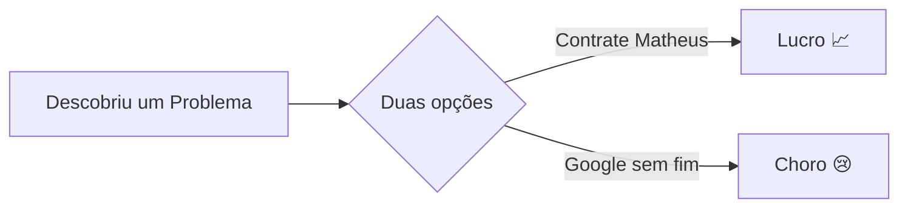

<!-- Profile header -->

<h1 align="center">Olá , sou Matheus Martins</h1>
<h3 align="center">Desenvolvedor Backend | Entusiasta de Automação</h3>

  

> **"Construindo sistemas que superam seus desenvolvedores."**

<!-- ABOUT -->

## 🧑‍💻 Sobre mim

Sou Desenvolvedor **Backend** (com vivência Full‑Stack) especializado em **C#/.NET** – porém confortável em **Python**, **TypeScript/JavaScript**, **Node.js**, **React** e **Next.js**.

Apaixonado por criar soluções que **automatizam rotinas** e **entregam valor real**. Já:

- Automatizei a busca de processos no sistema PJE na **AGU**, poupando 2 h/dia de trabalho manual.
- Contribuí com stack **React + Nest.js + Docker** para gestão de associados no **FASPM**.
- Migrei sistemas bancários legados para **.NET 8 + DDD** na **FISETECH**.

Atualmente sou graduado em **Análise e Desenvolvimento de Sistemas** pelo **IFPA** e exploro qualquer tech que melhore a eficiência de equipes.

<!-- PROJECTS -->

## 🚀 Projetos Implementados

| Projeto                                                                                     | Preview                                                                                                |
| :------------------------------------------------------------------------------------------ | :----------------------------------------------------------------------------------------------------- |
| **Audio‑Split**  (em breve no GitHub)                                         |  |
| **Portfólio Pessoal**   [https://matheusmartins.dev.br/](https://matheusmartins.dev.br/) |      |
| **Emaju Kids Club**   [https://emajukids.com.br/](https://emajukids.com.br/)             |    |

<!-- TECH STACK -->

## 🛠 Tecnologias

### Linguagens e Frameworks

### Bancos de dados e ferramentas

| Categoria           | Itens                                                                                                                                                                                                                                                          |
| ------------------- | -------------------------------------------------------------------------------------------------------------------------------------------------------------------------------------------------------------------------------------------------------------- |
| **Bancos de Dados** |  MySQL •  PostgreSQL |
| **DevOps**          | Docker • GitHub Actions                                                                                                                                                                                                                                        |
| **Padrões**         | DDD • Clean Architecture                                                                                                                                                                                                                                       |
| **Cloud**           | Azure (básico)                                                                                                                                                                                                                                                 |

<!-- EXPERIENCE -->

## 💼 Experiência

| Período                 | Posição & Empresa                                                  | Destaques                                                                                                                      |
| ----------------------- | ------------------------------------------------------------------ | ------------------------------------------------------------------------------------------------------------------------------ |
| **Mar 2025 – Atual**    | **Backend Developer – FISETECH**  Belém • Presencial | ● Migração de sistemas bancários para .NET 8 + EF Core   ● Adoção de arquitetura DDD, reduzindo   dívida técnica em 30 % |
| **Ago 2022 – Fev 2023** | **Full‑Stack Developer – FASPM**  Belém • Híbrido    | ● React/Nest.js Plataforma para gerenciamento de membros   ● CI dockerizada melhorando 4× o tempo de implantação            |
| **Abr 2022 – Ago 2022** | **Estagiário de Desenvolvimento – AGU**  Belém       | ● Automação de desktop (JavaFX + Selenium)   ● REST APIs com Spring, Automatizando fluxos de administração                  |

<!-- METRICS -->

## 📊 Estatísticas do GitHub

  
   
  
   
  

<!--START_SECTION:blog-->
*Feed do blog não disponível no momento*
<!--END_SECTION:blog-->

<!-- Dynamic PRs -->

<!--Start Count Merged PRs-->

<!--Finish Count Merged PRs-->

<!--Start Merged PRs-->

<!--Finish Merged PRs-->

<!-- QUOTE -->

> <!--START_QUOTE-->
>
> <!--END_QUOTE-->

<!-- FUN -->

## 🕹 Extras divertidos

<!-- SNAKE -->

  <picture>
    <source media="(prefers-color-scheme: dark)" srcset="https://github.com/AspMartins999/AspMartins999/blob/output/github-contribution-grid-snake-dark.svg">
    <source media="(prefers-color-scheme: light)" srcset="https://github.com/AspMartins999/AspMartins999/blob/output/github-contribution-grid-snake.svg">
    
  </picture>

<!-- CONTACT -->

## 📫 Contato

&nbsp;

---

"Em caso de incêndio: <code>git commit</code>, <code>git push</code>, saia do prédio."
