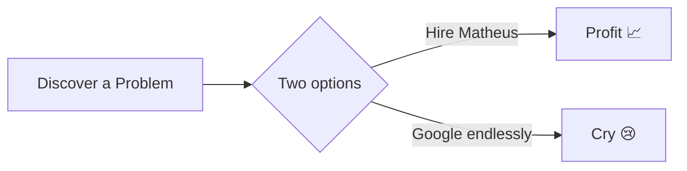

<!-- Profile header -->

<h1 align="center">Hi , I'm Matheus Martins</h1>
<h3 align="center">Backend Developer | Automation Enthusiast</h3>

  

> **"Building systems that outgrow their developers."**

<!-- ABOUT -->

## 🧑‍💻 Sobre mim

Sou Desenvolvedor **Backend** (com vivência Full‑Stack) especializado em **C#/.NET** – porém confortável em **Python**, **TypeScript/JavaScript**, **Node.js**, **React** e **Next.js**.

Apaixonado por criar soluções que **automatizam rotinas** e **entregam valor real**. Já:

* Automatizei a busca de processos no sistema PJE na **AGU**, poupando 2 h/dia de trabalho manual.
* Contribuí com stack **React + Nest.js + Docker** para gestão de associados no **FASPM**.
* Migrei sistemas bancários legados para **.NET 8 + DDD** na **FISETECH**.

Atualmente sou graduado em **Análise e Desenvolvimento de Sistemas** pelo **IFPA** e exploro qualquer tech que melhore a eficiência de equipes.

<!-- TAG LINE OPTIONS (to switch, just uncomment) -->

<!-- **"Turning complexity into clean, self‑healing APIs."** -->

<!-- **"Code once, automate forever."** -->

<!-- **"Let the servers do the boring part."** -->

<!-- **"From concept to container to cloud."** -->

<!-- PROJECTS -->

## 🚀 Projetos Implementados

| Projeto                                                                                      | Preview           |
| :------------------------------------------------------------------------------------------- | :---------------- |
| **Audio‑Split**  (soon on GitHub)                                              | *GIF coming soon* |
| **Personal Portfolio**   [https://matheusmartins.dev.br/](https://matheusmartins.dev.br/) | *GIF coming soon* |
| **Emaju Kids Club**   [https://emajukids.com.br/](https://emajukids.com.br/)              | *GIF coming soon* |

<!-- TECH STACK -->

## 🛠 Tech Stack

### Linguagens e Frameworks

### Bancos de dados e ferramentas

| categoria     | Items                                                                                                                                                                                                                                                              |
| ------------- | ------------------------------------------------------------------------------------------------------------------------------------------------------------------------------------------------------------------------------------------------------------------ |
| **Databases** |  MySQL   •    PostgreSQL |
| **DevOps**    | Docker • GitHub Actions                                                                                                                                                                                                                                            |
| **Patterns**  | DDD • Clean Architecture                                                                                                                                                                                                                                           |
| **Cloud**     | Azure (basics)                                                                                                                                                                                                                                                     |

<!-- EXPERIENCE -->

## 💼 experiência

| período                 | Posição & Empresa                                               | Highlights                                                                                                                     |
| ----------------------- | --------------------------------------------------------------- | ------------------------------------------------------------------------------------------------------------------------------ |
| **Mar 2025 – Present**  | **Backend Developer – FISETECH**  Belém • On‑site | ● Migração de sistemas bancários para .NET 8 + EF Core   ● Adoção de arquitetura DDD, reduzindo   dívida técnica em 30 % |
| **Aug 2022 – Feb 2023** | **Full‑Stack Developer – FASPM**  Belém • Hybrid  | ● React/Nest.js Plataforma para gerenciamento de membros   ● CI dockerizada melhorando 4× o tempo de implantação            |
| **Apr 2022 – Aug 2022** | **Software Developer Intern – AGU**  Belém        | ● Automação de desktop (JavaFX + Selenium)   ● REST APIs com Spring, Automatizando fluxos de administração                  |

<!-- METRICS -->

## 📊 Estatísticas do GitHub

   
   
  

<!--START_SECTION:blog-->

<!--END_SECTION:blog-->

<!-- Dynamic PRs -->

<!-- ### ✅ Merged PRs -->

<!--Start Count Merged PRs-->

<!--Finish Count Merged PRs-->

<!--Start Merged PRs-->

<!--Finish Merged PRs-->

<!-- QUOTE -->

> <!--START_QUOTE-->  
>
> <!--END_QUOTE-->

<!-- FUN -->

## 🕹 Extras divertidos

<!--  -->

<!-- SNAKE -->

  <picture>
    <source media="(prefers-color-scheme: dark)" srcset="https://github.com/AspMartins999/AspMartins999/blob/output/github-contribution-grid-snake-dark.svg">
    <source media="(prefers-color-scheme: light)" srcset="https://github.com/AspMartins999/AspMartins999/blob/output/github-contribution-grid-snake.svg">
    
  </picture>

<!-- CONTACT -->

## 📫 contato

&nbsp;

---

“In case of fire: <code>git commit</code>, <code>git push</code>, leave building.”
